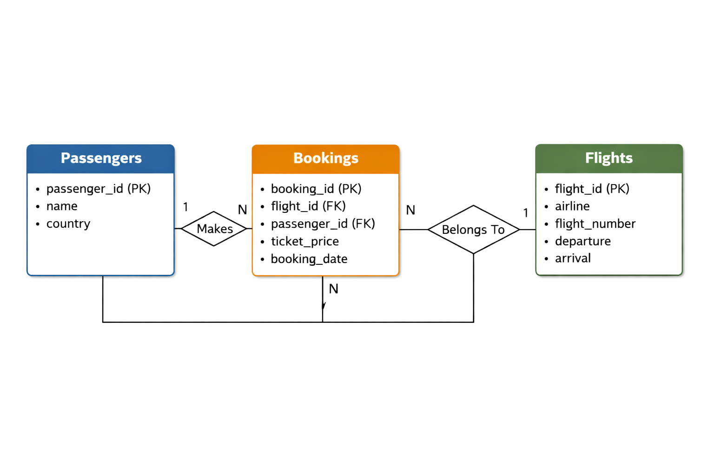
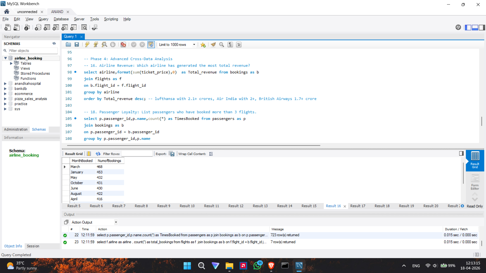

# SkyHigh Analytics: Airline Booking & Passenger Trend Analysis

## ✈️ Project Overview
This project focuses on transforming raw airline transactional data into actionable business intelligence. By analyzing passenger demographics, flight operations, and booking patterns using **SQL**, the goal is to provide strategic recommendations for revenue growth and route optimization.

The analysis covers:
* **1,000** Passengers
* **50** Unique Flights
* **5,000** Individual Bookings

## 📊 Database Schema

The project utilizes three relational tables. You can find the relationship diagram in the repository.
* **Passengers**: ID, Name, Age, Gender, Country.
* **Flights**: ID, Airline, Source/Destination, Distance.
* **Bookings**: ID, Ticket Price, Date, Seat Class (Economy/Business).

## 🛠️ Technologies Used
* **SQL (MySQL)**: For data extraction, cleaning, and complex joins.
* **Data Visualization**: (Add Power BI or Excel here if you used them for the charts!)

### 📈 Sample Analysis (SQL)

## 🔍 Key Insights
* **Revenue Multiplier**: Business Class generates **4x more revenue** per ticket than Economy, despite lower volume.
* **Market Leader**: The **UK** is the primary market, leading in both total passenger count and Business Class bookings.
* **Peak Demand**: **March** is the busiest month for bookings, and **Sundays** see the highest volume of transactions.
* **Top Airline**: **Lufthansa** leads in total revenue, while **Air India** dominates passenger loyalty among Indian travelers.

## ❓ Key Business Questions Answered
The analysis is structured into four phases to address specific business needs:

### Phase 1: Passenger Insights
* What is the gender distribution of our passenger base?
* Which top 5 countries contribute the highest number of travelers?
* What are the primary age demographics (Teens vs. Adults vs. Seniors)?

### Phase 2: Flight & Route Operations
* Which airlines operate the most flights in our network?
* What are the top 3 most frequent destination cities?
* What is the average flight distance across all routes?

### Phase 3: Booking & Revenue Analysis
* What is the total revenue generated across all bookings?
* How does ticket pricing compare between Business and Economy classes?
* Which day of the week sees the highest booking volume?

### Phase 4: Advanced Cross-Data Analysis
* Which specific airline is generating the highest total revenue?
* Who are our most loyal passengers (those with 3+ bookings)?
* Which airline is the preferred choice for passengers traveling from India?

## 🚀 Business Recommendations
1. **Expand High-Demand Routes**: Increase flight frequency to top destinations like Doha, Frankfurt, and Singapore.
2. **Targeted Marketing**: Focus premium marketing efforts on the UK and European markets to maximize Business Class sales.
3. **Dynamic Pricing**: Implement weekend-specific promotions to capitalize on Sunday booking peaks.
4. **Loyalty Programs**: Launch a rewards system targeting the "Frequent Flyer" segment (passengers with 3+ bookings).

## 📂 How to Use
1. Clone the repository.
2. Import the datasets found in the `/Data` folder into your SQL environment.
3. Run `Airline_Booking.sql` to replicate the analysis phases.

---
**Project by Anand** *March 2026*
